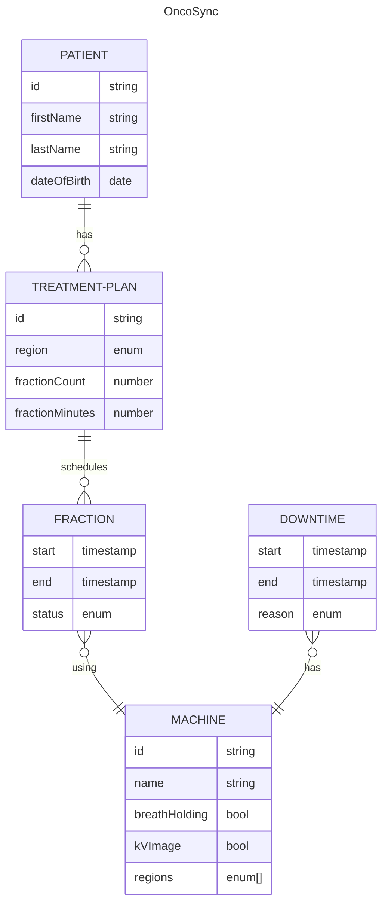

```mermaid
---
title: OncoSync
---
erDiagram
    PATIENT {
        id string
        firstName string
        lastName string
        dateOfBirth date
    }

    TREATMENT-PLAN {
        id string
        region enum
        fractionCount number
        fractionMinutes number
    }

    FRACTION {
        start timestamp
        end timestamp
        status enum
    }

    PATIENT ||--o{ TREATMENT-PLAN : has

    TREATMENT-PLAN ||--o{ FRACTION: schedules

    FRACTION }o--|| MACHINE: using

    MACHINE {
        id string
        name string
        breathHolding bool
        kVImage bool
        regions enum[]
    }

    DOWNTIME {
        start timestamp
        end timestamp
        reason enum
    }

    DOWNTIME }o--|| MACHINE: has
```
